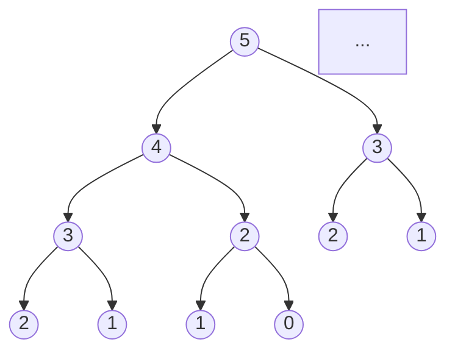

# Time Complexity of Recursive Fibonacci Series

This document provides a detailed explanation of the time complexity for the recursive Fibonacci algorithm, addressing common misconceptions and mathematical proofs.

## The Short Answer
The time complexity of the recursive Fibonacci algorithm is **Exponential**, specifically **O(2^n)** (loosely) or more precisely **O(1.618^n)**.

It **does** truly follow an exponential growth pattern, which is why it becomes strikingly slow for even small values of `n` (like `n=50`).

---

## Detailed Explanation

### 1. The Recurrence Relation
The Fibonacci sequence is defined by the relation:
$$ F(n) = F(n-1) + F(n-2) $$

This means to calculate the $n$-th number, we must calculate the two preceding numbers. In a naive recursive implementation, this structure is mirrored exactly in the work done by the computer.

Let $T(n)$ be the number of operations (or time) required to compute $F(n)$.
$$ T(n) = T(n-1) + T(n-2) + C $$
*(Where $C$ is the constant time taken for comparisons and addition).*

### 2. The Recursion Tree
Visualizing the calls helps understand verify the exponential growth. For `fib(5)`:

Notice the duplication?
- `fib(3)` is calculated **2 times**.
- `fib(2)` is calculated **3 times**.
- `fib(1)` is calculated **5 times**.

The number of functional calls grows roughly in relation to the Fibonacci sequence itself! Since the values of the Fibonacci sequence grow exponentially (related to the Golden Ratio), the number of calls also grows exponentially.

### 3. Mathematical Upper Bound O(2^n)
A simple way to see the upper bound is to approximate $T(n-2) \approx T(n-1)$ (since it's an upper bound).

$$ T(n) \approx 2 \times T(n-1) $$

This recurrence resolves to:
$$ T(n) \approx 2 \times 2 \times T(n-2) \approx 2^k \times T(n-k) $$
$$ T(n) \approx 2^n $$

Thus, the complexity is **O(2^n)**.

### 4. Precise Complexity O(1.618^n)
For a more exact measure, the tight bound is related to the Golden Ratio ($\phi \approx 1.618$).
$$ T(n) = \Theta(\phi^n) $$

This is still exponential. The misconception that it "doesn't TRULY follow exponential time" often comes from confusing the value **2** in $2^n$ with strictly binary doubling. While it's not exactly doubling every step (it's growing by $\times 1.618$), it is mathematically strictly exponential.

## Summary vs User Comment
| Concept | Correction |
| :--- | :--- |
| "Does not TRULY follow exponential" | **Incorrect.** It is mathematically exponential. $1.618^n$ is an exponential function. |
| Time Complexity | **O(2^n)** is the correct Big-O notation for the upper bound. |
| "Complexity of pos 6 is twice pos 5" | **Roughly Correct.** Since $1.618$ is close to 2, strictly speaking $F(6) \approx 1.618 \times F(5)$, but "twice" is a decent mental model for the explosion in work. |
